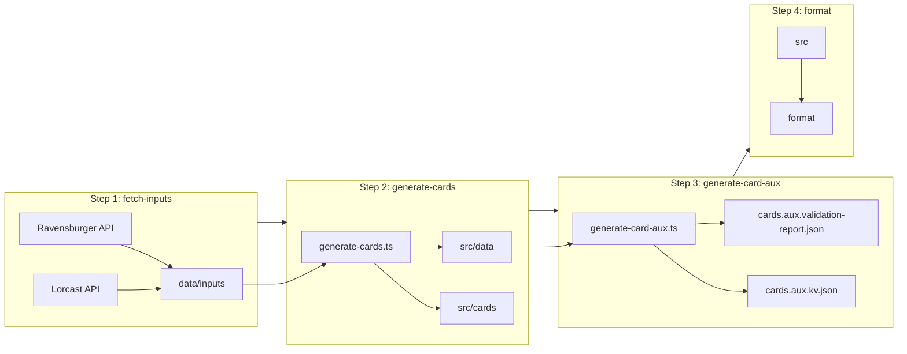

# Documentation for `generate-cards-all.ts`

## 1. Purpose and role

- **What it is:** Top-level orchestration script for the Lorcana card generation pipeline in `@tcg/lorcana-cards`.
- **What it does:** Runs a fixed sequence of steps (fetch → generate → aux → format) in order, with optional skip flags, and exits on first failure.
- **When to use:** Default for "regenerate everything" (e.g. `bun run generate-cards:all`). Use `--skip-fetch` when iterating on generation logic with cached inputs; use `--skip-format` when CI or another tool handles formatting.

## 2. Pipeline steps (order and behavior)

| Step                 | Script / command                   | Skip flag       | Description                                                                                        |
| -------------------- | ---------------------------------- | --------------- | -------------------------------------------------------------------------------------------------- |
| 1. fetch-inputs      | `bun scripts/fetch-inputs.ts`      | `--skip-fetch`  | Fetches latest data from Ravensburger and Lorcast APIs into `data/inputs/`.                        |
| 2. generate-cards    | `bun scripts/generate-cards.ts`    | _(none)_        | Builds canonical cards, IDs, printings; writes TS files and JSON under `src/cards` and `src/data`. |
| 3. generate-card-aux | `bun scripts/generate-card-aux.ts` | `--skip-aux`    | Builds aux KV maps (identity/reprint/localization) and validation report from generated cards.     |
| 4. format            | `bun run format` (npm script)      | `--skip-format` | Runs formatter (e.g. oxfmt) on `./src`.                                                            |

- Steps with a skip flag are omitted when that flag is present in `process.argv`.
- Steps 1, 3, and 4 are optional (skippable); step 2 always runs when the script runs (no skip flag).
- Execution is strictly sequential: step N runs only after step N−1 succeeds (or was skipped).

## 3. Implementation details

- **Step definition:** Each step is a `Step` object: `name`, `script`, optional `skipFlag`, and `runNpmScript` (if true, the script is invoked as `bun run ${script}`; otherwise as `bun ${script}`).
- **CLI parsing:** `process.argv.slice(2)` is collected into a `Set` of flags; no value parsing (e.g. `--skip-fetch=true`) is used—only presence of the flag matters.
- **Execution:** For each step, if `step.skipFlag` is in the set, the step is skipped with a log message. Otherwise the script runs via Bun's `$` (shell) template; on non-zero exit, the process logs the failure and exits with code 1 (no later steps run).
- **Paths:** `PACKAGE_ROOT` is derived from `import.meta.dir` (directory containing the script), so the script is robust to being run from repo root or from inside the package.

## 4. Data flow (high level)

- **Inputs to the pipeline:** Fetched by step 1 into `data/inputs/` (e.g. `ravensburger-input.json`, `lorcast-input.json`). If `--skip-fetch` is used, step 2 reads whatever is already in `data/inputs/`.
- **Outputs:**
  - Step 2 produces `src/data/sets.json`, `src/data/canonical-cards.json`, `src/data/cards.aux.printing-metadata.json`, and `src/cards/**/*.ts`.
  - Step 3 produces `src/data/cards.aux.kv.json` (identity/reprint/localization lookups) and `src/data/cards.aux.validation-report.json`.
  - Step 4 only reformats existing `./src` files.
  - Note: `printings.json` is no longer generated; use `cards.aux.printing-metadata.json` + `cards.aux.kv.json` instead.

## 5. How to run

- **From repo root (typical):**  
  `bun run generate-cards:all`  
  (runs the npm script `generate-cards:all` from `package.json`, which runs `bun scripts/generate-cards-all.ts`).

- **With cached inputs (no API calls):**  
  `bun run generate-cards:all --skip-fetch`

- **Skip aux generation (not recommended):**  
  `bun run generate-cards:all --skip-aux`

- **Skip formatting:**  
  `bun run generate-cards:all --skip-format`

- **Multiple flags:**  
  `bun run generate-cards:all --skip-fetch --skip-format`

Note: `--` may be required depending on the host (e.g. `bun run generate-cards:all -- --skip-fetch`) so that flags are passed to the script and not to `bun run`.

## 6. Relationship to other scripts

- **fetch-inputs.ts:** Fetches Ravensburger (per locale) and Lorcast data; writes to `data/inputs/`. Used as step 1.
- **generate-cards.ts:** Reads `data/inputs/`, builds sets/printings/canonical cards and ID mapping, validates, then writes `src/data/sets.json`, `src/data/canonical-cards.json`, `src/data/cards.aux.printing-metadata.json`, and `src/cards/**`. Used as step 2.
- **generate-card-aux.ts:** Reads generated cards and printing metadata; builds aux KV maps (identity, reprints, localization), validates, then writes `src/data/cards.aux.kv.json` and `src/data/cards.aux.validation-report.json`. Used as step 3.
- **package.json scripts:** `generate-cards:all` runs this orchestrator; `fetch` and `generate` run individual steps (fetch only, or generate + format) for one-off use.

## 7. Error handling and output

- **On success:** Logs a "PIPELINE COMPLETE" banner after all steps (run or skipped).
- **On failure:** Logs "Step `<name>` failed!" and exits with code 1; subsequent steps are not run.
- **Console output:** Uses box-drawing and repeat characters for section headers and separators so the pipeline progress is easy to follow in the terminal.
